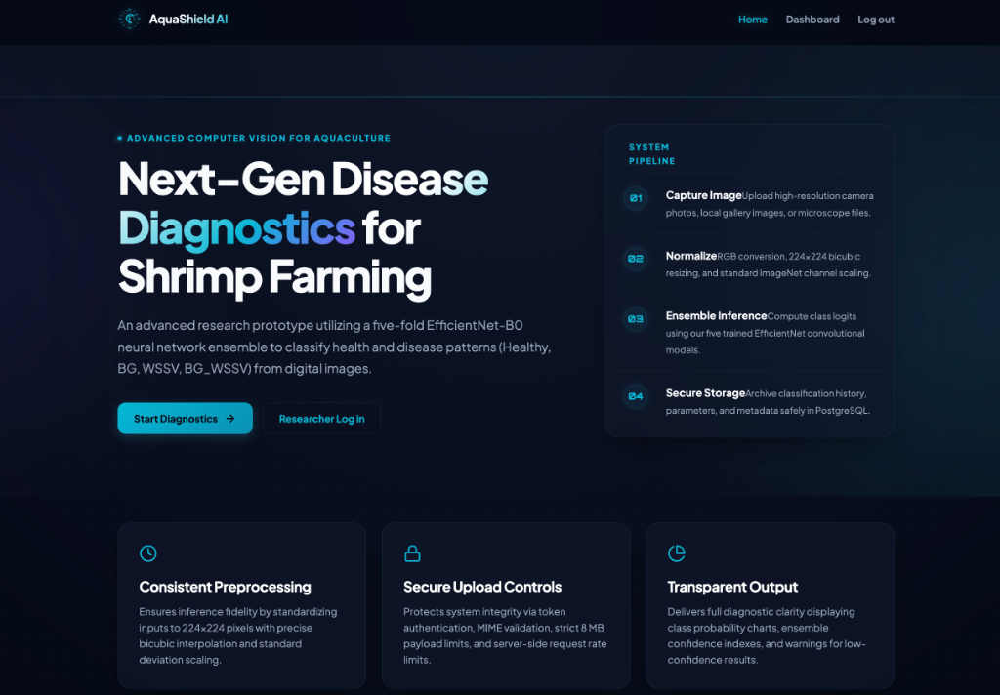
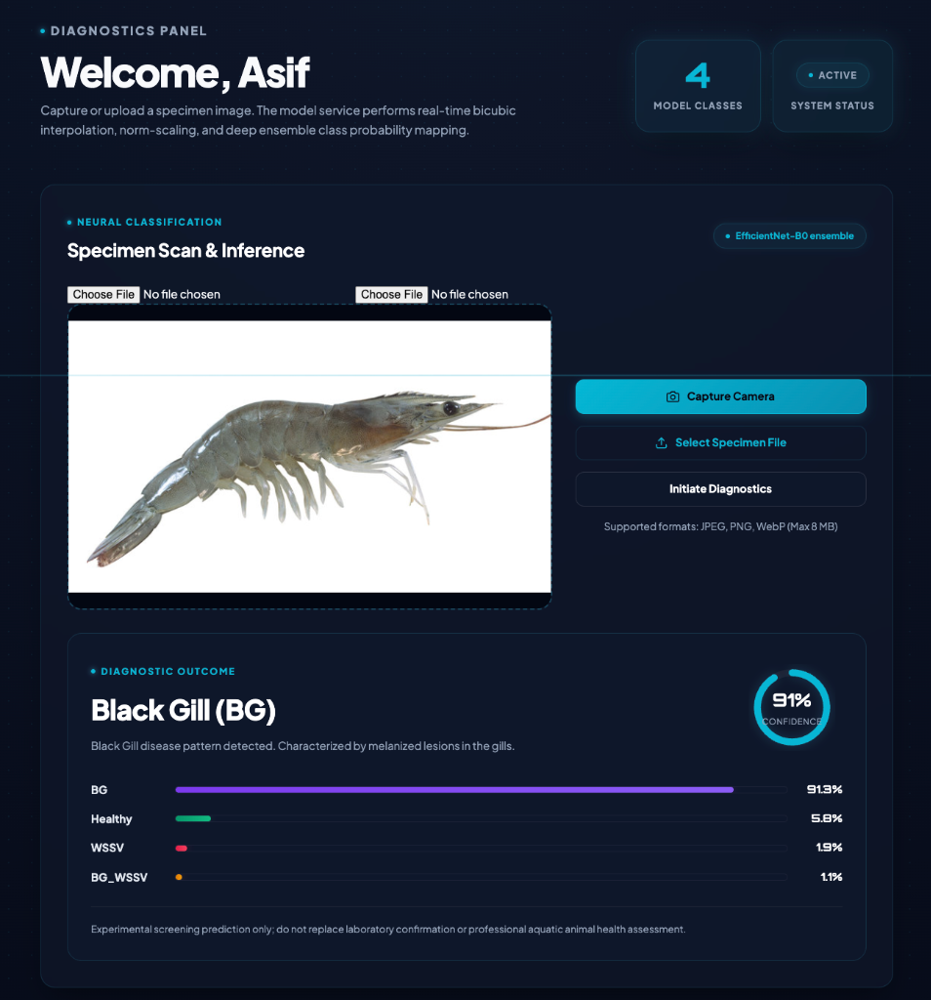
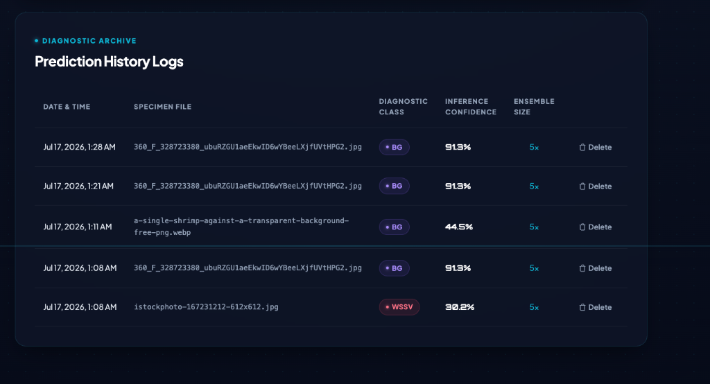
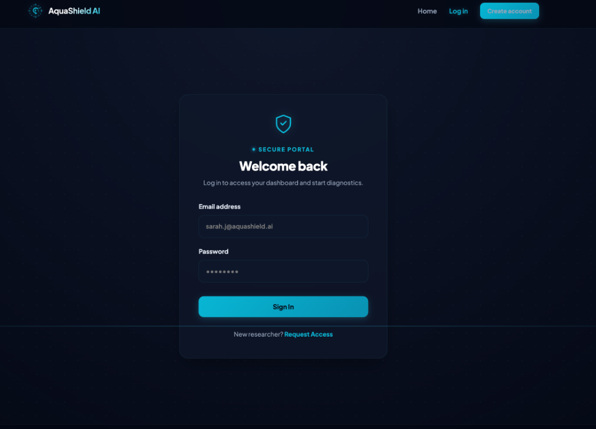

# AquaShield AI — Shrimp Disease Classification

> **Live Demo**: [https://aqua-shield-ai.vercel.app/](https://aqua-shield-ai.vercel.app/)
>
> * **Backend API**: `https://aquashield-ai-1.onrender.com`
> * **FastAPI ML Inference**: `https://aquashield-ai-rcgc.onrender.com`

A complete research-prototype application for classifying shrimp images into:

- `Healthy`
- `BG`
- `WSSV`
- `BG_WSSV`

The system uses a **Next.js frontend**, **Express.js TypeScript API**, **PostgreSQL with Prisma**, and a **FastAPI/PyTorch inference service**. The Kaggle script trains an EfficientNet-B0 five-fold ensemble and exports exactly the files used by the web application.

> Important: This is an experimental screening system. It must not be presented as a replacement for laboratory confirmation or professional aquatic animal health assessment.

## User Interface & Diagnostics Panel

Here are the interface screens of the modernized **AquaShield AI** application:

### 1. Landing Page


### 2. Diagnostics Panel (Specimen Scan & Inference)


### 3. Diagnostic Archive Logs


### 4. Secure Access Portal


## Project structure

```text
shrimp-disease-platform/
├── kaggle/
│   ├── shrimp_training_export.py
│   └── shrimp_training_export.ipynb
├── ml-service/
│   ├── app/main.py
│   ├── models/
│   ├── requirements.txt
│   └── Dockerfile
├── backend/
│   ├── prisma/schema.prisma
│   ├── src/
│   ├── package.json
│   └── Dockerfile
├── frontend/
│   ├── app/
│   ├── components/
│   ├── lib/
│   ├── package.json
│   └── Dockerfile
├── docker-compose.yml
└── README.md
```

## How one prediction works

```text
Mobile camera/gallery/file manager
            ↓
Next.js sends multipart/form-data
            ↓
Express validates authentication, MIME type and size
            ↓
FastAPI converts to RGB and applies 224×224 inference preprocessing
            ↓
1–5 EfficientNet-B0 checkpoints produce probabilities
            ↓
Mean probability gives final class and confidence
            ↓
Express saves the result through Prisma/PostgreSQL
            ↓
Next.js displays probabilities and prediction history
```

## Part 1 — Train and export the model on Kaggle

### 1. Create a Kaggle notebook

1. Open Kaggle and create a new notebook.
2. Attach the `ShrimpDiseaseImageBD` dataset as notebook input.
3. In Notebook Settings, select a **GPU T4** accelerator.
4. Turn Internet on if `timm` is not already installed.

### 2. Run the training code

Use either method:

- Upload `kaggle/shrimp_training_export.ipynb`; or
- Copy all code from `kaggle/shrimp_training_export.py` into one Kaggle cell.

The default setting trains all five folds:

```python
RUN_FOLDS = [0, 1, 2, 3, 4]
```

For a quick pipeline test first, use:

```python
RUN_FOLDS = [0]
EPOCHS = 3
```

Return to all five folds for your final experiment.

### 3. Download the deployment bundle

After training, download:

```text
/kaggle/working/shrimp_outputs/shrimp_model_deployment_bundle.zip
```

It contains:

```text
best_efficientnet_b0_fold0.pth
best_efficientnet_b0_fold1.pth
best_efficientnet_b0_fold2.pth
best_efficientnet_b0_fold3.pth
best_efficientnet_b0_fold4.pth
best_efficientnet_b0_fold*_metadata.json
model_manifest.json
```

Extract those files into:

```text
ml-service/models/
```

The inference service automatically loads every checkpoint listed in `model_manifest.json`. It also works with one checkpoint while you test the system.

## Part 2 — Recommended local setup

Prerequisites:

- Node.js 20 or newer
- Python 3.11 or 3.12
- PostgreSQL 15 or newer, or Docker Desktop
- The model deployment files inside `ml-service/models/`

### Step A — Start PostgreSQL

The easiest option is Docker:

```bash
docker compose up -d postgres
```

This creates:

```text
Database: shrimp_disease
User: postgres
Password: postgres
Port: 5432
```

### Step B — Run the PyTorch inference service

```bash
cd ml-service
python -m venv .venv
```

Activate it:

**macOS/Linux**

```bash
source .venv/bin/activate
```

**Windows PowerShell**

```powershell
.venv\Scripts\Activate.ps1
```

Install and run:

```bash
pip install -r requirements.txt
cp .env.example .env
uvicorn app.main:app --reload --host 0.0.0.0 --port 8000
```

Check:

```text
http://localhost:8000/health
http://localhost:8000/docs
```

Expected health output should show `ensembleSize` from 1 to 5.

### Step C — Run Express, Prisma and PostgreSQL

Open a second terminal:

```bash
cd backend
cp .env.example .env
npm install
npx prisma generate
npx prisma migrate dev --name init
npm run dev
```

The API runs at:

```text
http://localhost:5000
http://localhost:5000/api/health
```

Open Prisma Studio when needed:

```bash
npm run prisma:studio
```

### Step D — Run Next.js

Open a third terminal:

```bash
cd frontend
cp .env.example .env.local
npm install
npm run dev
```

Open:

```text
http://localhost:3000
```

Create an account, open the dashboard, take or select a shrimp image, and run the classification.

## Part 3 — Run nearly everything with Docker

First place the `.pth` files and `model_manifest.json` in `ml-service/models/`.

Then run:

```bash
docker compose up --build
```

Open:

```text
Frontend: http://localhost:3000
Backend: http://localhost:5000/api/health
Model API: http://localhost:8000/health
```

For the very first database initialization, if the backend reports that no migration exists, run the normal local Prisma command once:

```bash
cd backend
npm install
cp .env.example .env
npx prisma migrate dev --name init
```

Commit the generated `backend/prisma/migrations/` folder. Future Docker deployments can then use `prisma migrate deploy` automatically.

## Environment variables

### Backend `.env`

```env
NODE_ENV=development
PORT=5000
JWT_SECRET=replace-with-a-long-random-secret-at-least-32-characters
JWT_EXPIRES_IN=7d
FRONTEND_URL=http://localhost:3000
ML_SERVICE_URL=http://localhost:8000
MAX_IMAGE_BYTES=8388608
```

Multiple deployed frontend origins can be comma-separated in `FRONTEND_URL`.

### Frontend `.env.local`

```env
NEXT_PUBLIC_API_URL=http://localhost:5000/api
```

### Model service `.env`

```env
MODEL_DIR=models
MODEL_PATTERN=best_efficientnet_b0_fold*.pth
MAX_IMAGE_BYTES=8388608
LOW_CONFIDENCE_THRESHOLD=0.60
ALLOWED_ORIGINS=http://localhost:3000,http://localhost:5000
```

## Main API endpoints

| Method | Endpoint | Purpose |
|---|---|---|
| `GET` | `/api/health` | Database and model-service health |
| `POST` | `/api/auth/register` | Register user |
| `POST` | `/api/auth/login` | Login and receive access token |
| `GET` | `/api/auth/me` | Current user |
| `POST` | `/api/predictions` | Upload and classify image |
| `GET` | `/api/predictions` | User prediction history |
| `GET` | `/api/predictions/stats/summary` | User class statistics |
| `GET` | `/api/predictions/:id` | One saved prediction |
| `DELETE` | `/api/predictions/:id` | Delete one saved prediction |

The upload field name must be:

```text
image
```

## Test the backend without the frontend

1. Register:

```bash
curl -X POST http://localhost:5000/api/auth/register \
  -H "Content-Type: application/json" \
  -d '{"name":"Mahdi","email":"mahdi@example.com","password":"StrongPass123"}'
```

2. Copy the returned token.

3. Classify an image:

```bash
curl -X POST http://localhost:5000/api/predictions \
  -H "Authorization: Bearer YOUR_TOKEN" \
  -F "image=@/absolute/path/to/shrimp.jpg"
```

## Deployment guidance

### Frontend

Deploy `frontend/` to Vercel. Set:

```env
NEXT_PUBLIC_API_URL=https://your-express-api.example.com/api
```

Rebuild the frontend after changing this public environment variable.

### Express backend

Deploy `backend/` to a Node/Docker host. Set all backend environment variables and run:

```bash
npm run build
npx prisma migrate deploy
npm start
```

### PostgreSQL

Use a managed PostgreSQL provider. Place its connection string in `DATABASE_URL`. Use a pooled connection string when your provider recommends it.

### PyTorch service

Deploy `ml-service/` to a Docker-capable host with enough memory for the model ensemble. Copy the model bundle into the image or mount it from persistent storage. Set the backend `ML_SERVICE_URL` to its HTTPS URL.

### Camera access

Mobile browser camera capture is most reliable on an **HTTPS** deployed frontend. The frontend provides separate camera and gallery/file inputs because browser behavior differs across Android, iOS and desktop devices.

## Security already included

- Password hashing with bcrypt
- JWT authentication
- Helmet security headers
- CORS origin allow-list
- API rate limiting
- Server-side Zod validation
- Image MIME allow-list
- 8 MB upload limit
- User-scoped prediction queries and deletion
- No uploaded image is permanently stored by default

For a public production application, the next security upgrade should be replacing browser `localStorage` access tokens with short-lived access tokens and secure HttpOnly refresh cookies.

## Model consistency rules

Never change these values independently in the web service:

```text
Model: efficientnet_b0
Input: RGB
Size: 224 × 224
Class order: Healthy, BG, WSSV, BG_WSSV
Mean: 0.485, 0.456, 0.406
Std: 0.229, 0.224, 0.225
```

The included inference service reads these values from `model_manifest.json` so the training and deployment configurations remain aligned.

## Common errors

### `No .pth checkpoints found`

Extract `shrimp_model_deployment_bundle.zip` into `ml-service/models/`.

### `Model service is unavailable`

Confirm FastAPI is running at the URL used by `ML_SERVICE_URL`.

### Prisma cannot connect

Confirm PostgreSQL is running and `DATABASE_URL` uses the correct hostname. From your computer use `localhost`; inside Docker Compose use `postgres`.

### Camera button opens only a file chooser

This depends on browser/device support. Test on a phone over HTTPS. The gallery/file button remains available as a fallback.

### Low-confidence prediction

Capture another well-lit close image with the shrimp occupying most of the frame. Do not treat a low-confidence output as a reliable disease finding.
